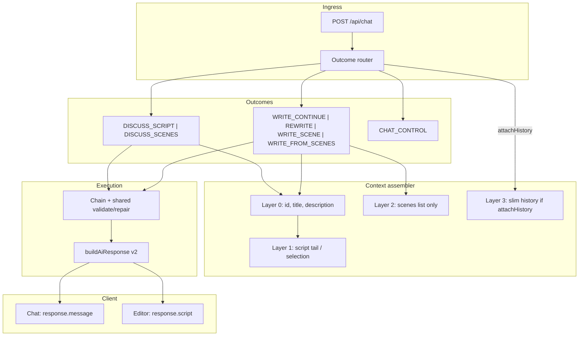
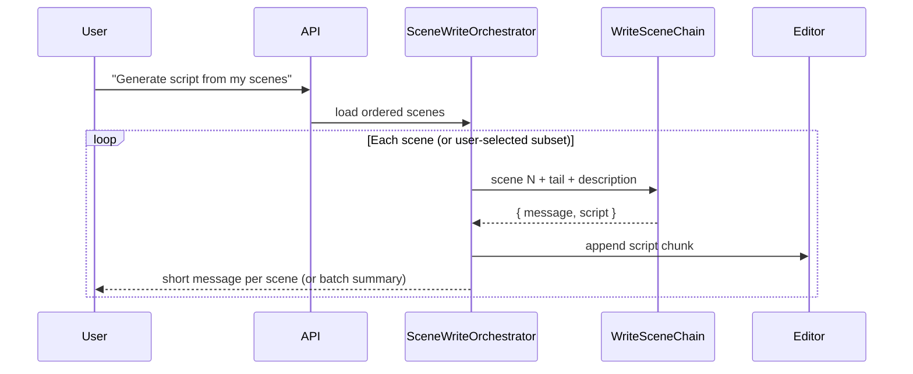

# AI Chat — High-Value Implementation & Refactor Plan

> **Status:** Approved (with tightening revisions, May 2026)  
> **Companion docs:** `docs/ai-conversation-code.md` (current behavior), `docs/AI_CHAT_FLOW_E2E.md` (chain detail)  
> **Principle:** Script-generation engine with a short conversational control layer — not a long-form sidebar chatbot.

**One sentence:** First stop dumping script into chat, then make context lazy, then add scene-aware writing once the output contract is reliable.

---

## Best first coding target

**P1 (hard gate) + partial P2** — no router or new intents until P1 passes.

| Priority | Work |
|----------|------|
| 1 | Fix `ScriptAppendChain` so script is not copied into chat |
| 2 | Add `WritingResponseNormalizer` |
| 3 | Disable question generation for all writing paths |
| 4 | Add context profiles starting with `minimal` + `script_tail` |
| 5 | Stop sending heavy client context by default |

---

## Phase 1 — Hard gate (must pass before P2+)

**No context-assembler, outcome-router, or new-chain work until this is done.**

The v2 contract already defines the product split: chat consumes `response.message`, editor append consumes `response.script`. P1 enforces that split on every **WRITE_*** path (including fast-path mutations).

| Rule | Requirement |
|------|-------------|
| `response.message` | Short confirmation only (≤ ~240 chars; no screenplay XML) |
| `response.script` | Full tagged screenplay only (editor channel) |
| Duplication | **Never** copy `script` into `message` |

**Gate checklist (all required):**

- [x] `WritingResponseNormalizer` used by every writing chain `formatResponse`
- [x] `ScriptAppendChain` fixed (no mirrored text)
- [x] Audit: `ScriptNextLinesChain`, `ScriptPageAppendChain`, mutation handlers
- [x] `buildAiResponse` rejects or strips script tags in `message` for WRITE_*
- [x] `shouldGenerateQuestions: false` on all writing paths
- [x] Contract test: WRITE_* `message` has no `<speaker>` / `<dialog>`
- [x] Contract test: WRITE_* `script` still appends in editor

**Partial P2 (shipped):** `assembleContext`, `script_tail`, `attachHistory` heuristic, `buildWritingChainContext`, coordinator + mutation paths, light client context.

---

## Product objectives (non-negotiable)

| # | Objective |
|---|-----------|
| 1 | Treat the bot as a **script-generation engine**, not a long-form chatbot. |
| 2 | Keep **chat short**; put real screenplay output in `response.script`. |
| 3 | **Never** duplicate screenplay text into `response.message`. |
| 4 | Route by **outcome first**: write, rewrite, discuss script, discuss scenes; use `attachHistory` for follow-up context. |
| 5 | Use **lazy context profiles** — do not attach everything on every request. |
| 6 | **Default context:** title, description, script tail; current selection when relevant. |
| 7 | Load **scenes only** when the user asks about scenes, outline, beats, or scene numbers. |
| 8 | **History off by default**; set `attachHistory: true` only for follow-ups (“that / last version / what you wrote”) — not a separate outcome. |
| 9 | Add **`WRITE_SCENE`** and **`WRITE_FROM_SCENES`** as first-class intents. |
| 10 | Generate full scripts **scene-by-scene**, not one giant response. |
| 11 | **Disable follow-up question buttons** by default on writing paths. |
| 12 | Add **shared validation/repair** for every script-writing chain. |
| 13 | Keep the existing **v2 contract:** `message` → chat UI, `script` → editor. |

---

## Target architecture (summary)



---

## Outcome taxonomy (routing model)

Replace “many conversational intents” with **outcomes**. Each outcome maps to one context profile, one chain (or orchestrator), and strict output rules.

**Outcomes (product):**

| Outcome | Intent constant (proposed) | `response.script` | `response.message` | Editor op |
|---------|---------------------------|-------------------|--------------------|-----------|
| Continue / append | `WRITE_CONTINUE` (maps to `NEXT_FIVE_LINES`, `APPEND_SCRIPT`) | Required | Short confirm only | Append |
| Rewrite selection | `REWRITE` | Required | Short confirm only | Replace range |
| Write one scene from list | `WRITE_SCENE` | Required | Short confirm only | Append (scene block) |
| Write from full scene list | `WRITE_FROM_SCENES` | Per-scene chunks | Short confirm per step | Append (orchestrated) |
| Talk about script | `DISCUSS_SCRIPT` | `null` | Short insight | None |
| Talk about scene list | `DISCUSS_SCENES` | `null` | Short insight | None |
| No script loaded | `CHAT_CONTROL` / `GENERAL_CONVERSATION` | Usually `null` | Short | None |

**Context flag (not an outcome):**

| Flag | Type | Default | When true |
|------|------|---------|-----------|
| `attachHistory` | `boolean` | `false` | Follow-up references prior turn: “that”, “what you wrote”, “last version”, etc. |

`attachHistory` composes with any outcome — e.g. `WRITE_CONTINUE` + `attachHistory: true` still produces short `message` + full `script`; only Layer 3 (slim last 3 turns) is added to the prompt. History describes **context**, not product outcome.

**Fast path (keep):** Regex handlers in `chat.controller.js` for next-five-lines, append-page, full-script remain **WRITE_CONTINUE** shortcuts — they must not fall through to general conversation.

**Deprioritize:** Default `SCRIPT_CONVERSATION` that returns 16–20 lines duplicated in chat (`ScriptAppendChain` today).

---

## Context profiles (lazy layers)

Implement a single **`assembleContext(outcome, request)`** used by controller + `ConversationCoordinator` (replaces ad-hoc `includeScriptContext` + always-on collections + default history).

| Layer | Data | Default | Attach when |
|-------|------|---------|-------------|
| **0** | `scriptId`, `title`, `description`, `intent`, `chatRequestId` | Always | Every request |
| **1a** | Script **tail** (last N lines or last page; configurable N) | WRITE_*, REWRITE, DISCUSS_SCRIPT | Writing or script discussion |
| **1b** | **Selection** (line range + text) | Off | REWRITE, or prompt/UI signals selection |
| **2** | **Scenes only** `[{ sortIndex, title, description }]` | Off | `DISCUSS_SCENES`, `WRITE_SCENE`, `WRITE_FROM_SCENES`, or scene/outline/beat heuristics |
| **3** | **Slim history** (max 3 turns; assistant = `message` only) | Off | `attachHistory: true` (follow-up heuristics) |
| **4** | Full `scriptCollections` (characters, locations, themes) | **Off** | Explicit future intent only — not in this plan |

**Do not attach:** Full script body on every request (use tail unless script is small or empty). Client `ScriptContextManager` should stop sending heavy analysis by default; server is source of truth for what enters the model.

### Scenes detection (Layer 2)

Heuristics + optional classifier flags (same request, no extra round trip if regex is confident):

- Keywords: `scene list`, `outline`, `beats`, `scene 2`, `act 2`, `from my scenes`, `write scene`, etc.
- Registry prompt types that target scenes

Load via existing `prisma.scene` / `getScriptCollections` path but **return only `scenes` array**, not characters/locations/themes.

### History detection (`attachHistory` → Layer 3)

Default: `attachHistory: false`, `disableHistory: true`, `chatHistory: []`.

Set `attachHistory: true` when:

- Regex: `\b(that|what you (wrote|said)|last (version|time)|change (it|that)|like you suggested)\b`
- Optional classifier field: `attachHistory: true` (not a separate intent)

`assembleContext` sets Layer 3 only when the flag is true; outcome unchanged.

Slim format:

```json
[
  { "role": "user", "content": "<prompt, capped>" },
  { "role": "assistant", "content": "<message only, capped, no script XML>" }
]
```

Persist full turns in DB for UI; **do not** mirror full `script` into prompt history.

### Selection (Layer 1b)

- Frontend: include `selection: { startLine, endLine, text }` in POST `context` when user has a non-empty editor selection and prompt implies rewrite.
- Server: REWRITE chain uses selection instead of tail for the “source” block; still send tail for continuity after the block if needed.

---

## Output contract (enforce everywhere)

**v2 (unchanged):**

```typescript
response: {
  message: string | null;  // chat UI only — short
  script: string | null;   // editor only — XML-tagged screenplay
  metadata?: object;
}
```

**Writing chains must:**

1. Use structured model output (JSON or function) with separate fields: `assistantMessage`, `formattedScript` (internal names; map to v2 on exit).
2. Set `message` = short confirmation; `script` = tagged lines only.
3. **Never** assign the same string to both fields (fix `ScriptAppendChain.formatResponse` pattern).

**Message length policy:** Target ≤ 240 characters for WRITE_*; DISCUSS_* may go slightly longer but still paragraph-scale, not page-scale.

**Question buttons:** `shouldGenerateQuestions: false` for all WRITE_*, REWRITE, WRITE_SCENE, WRITE_FROM_SCENES. Optional for DISCUSS_* only (e.g. “Write this scene”, “Next 5 lines”).

---

## Shared validation & repair

Centralize in one module (extend `shared/langchainConstants.js` + server helper; avoid per-chain drift).

| Check | Applies to | Action on failure |
|-------|------------|-------------------|
| v2 contract (`validateAiResponse`) | All mutation outcomes | 400 / retry |
| Required `script` | WRITE_*, REWRITE | Reject |
| Line count min/max per contract | CONTINUE, PAGE, SCENE | Retry (max 2–3) |
| XML tag whitelist / speaker→dialog | All WRITE_* | Retry then repair pass on final attempt |
| `message` not containing script tags | All WRITE_* | Strip or regenerate message |

**New contracts in `OUTPUT_CONTRACTS`:**

```javascript
WRITE_SCENE:       { scriptRequired: true, minLines: …, maxLines: …, responseFields: ['message'] }
WRITE_FROM_SCENES: { scriptRequired: true, per-scene bounds, responseFields: ['message'] }
REWRITE:           { scriptRequired: true, …, responseFields: ['message'] }
DISCUSS_SCRIPT:    { scriptRequired: false, responseFields: ['message'] }
DISCUSS_SCENES:    { scriptRequired: false, responseFields: ['message'] }
```

Wire through `buildValidatedChatResponse` and client `ScriptOperationsHandler` (same validation keys).

---

## WRITE_FROM_SCENES orchestration

**Not** one model call for the entire screenplay.



**Design choices:**

- **Phase 1:** User triggers one scene (“write scene 3”) → single `WRITE_SCENE` call.
- **Phase 2:** “Write all scenes” → server loop with progress in `metadata` (e.g. `{ currentScene: 2, total: 8 }`) or SSE later; client appends after each valid chunk.
- Respect token limits: one scene outline + tail per call.
- Idempotency: `chatRequestId` + `sceneIndex` in metadata for logging/retries.

---

## Implementation phases

### Phase 0 — Spec & alignment (no behavior change)

**Goal:** Single source of truth for the team.

| Task | Deliverable |
|------|-------------|
| Lock outcome table and context profiles | This doc + review sign-off |
| Add outcome constants; document `attachHistory` on request context | `WRITE_SCENE`, `WRITE_FROM_SCENES`, `REWRITE`, `DISCUSS_SCENES` — **not** `NEEDS_HISTORY` as intent |
| Document breaking changes | `ScriptAppendChain` default path narrowed or removed from default route |

**Exit criteria:** Team agrees on routing table and “message vs script” rules.

---

### Phase 1 — Output discipline (**hard gate**)

See **[Phase 1 — Hard gate](#phase-1--hard-gate-must-pass-before-p2)** above. Implementation tasks:

| Task | Files (primary) |
|------|-----------------|
| Add `WritingResponseNormalizer` (`assistantMessage` + `formattedScript` → v2) | New: `server/controllers/langchain/chains/helpers/WritingResponseNormalizer.js` |
| Fix `ScriptAppendChain.formatResponse` — never copy script into `message` | `ScriptAppendChain.js` |
| Audit all chains’ `formatResponse` / `ensureCanonicalResponse` | `ScriptNextLinesChain.js`, `ScriptPageAppendChain.js`, `DefaultChain.js`, `ScriptReflectionChain.js` |
| Guard `message` in `buildAiResponse` if script tags detected | `ai-response.service.js` |
| Frontend: short bubble only; optional “N lines added to script” | `ChatManager.js`, `ResponseExtractor.js` |
| `shouldGenerateQuestions: false` on all writing paths | `chat/chain/config.js`, `chat.controller.js` |

**Do not start Phase 2+ until the hard-gate checklist is complete.**

---

### Phase 2 — Context assembler (foundation for intelligence)

**Goal:** Relevant, smaller prompts → better script.

| Task | Files (primary) |
|------|-----------------|
| Create `assembleContext({ outcome, attachHistory, scriptId, prompt })` | New: `server/controllers/chat/context/assembleContext.js` |
| **Partial P2 (first slice):** profiles `minimal` + `script_tail` | `assembleContext.js` |
| Implement tail extraction (server-side) | `context-builder.service.js`, script read path |
| Default `attachHistory: false`; detect flag → Layer 3 | `chat/intent/heuristics.js` (`isAttachHistoryRequest`) |
| Replace `ConversationCoordinator.buildContext` with profiles | `ConversationCoordinator.js` |
| Stop client heavy context (`includeHistory`, analysis) by default | `ChatManager.js`, `ScriptContextManager.js` |
| Mutation fast paths: `minimal` + `script_tail`, no collections | `chat.controller.js` |
| Scenes-only loader + Layer 2 (remainder of P2) | `context-collections.service.js` — after P1 gate |

**Exit criteria (partial P2):**

- Next-five-lines uses title + description + tail only.
- `attachHistory: false` unless follow-up regex matches.
- No `scriptCollections` on CONTINUE fast path.

**Exit criteria (full P2):**

- Layer 2 scenes attach only on scene/outline heuristics.

---

### Phase 3 — Outcome router (simplify routing)

**Goal:** Route by outcome before chain name.

| Task | Files (primary) |
|------|-----------------|
| `resolveOutcome(prompt, context)` → outcome enum | New: `server/controllers/chat/intent/resolveOutcome.js` |
| Map outcome → chain + context profile | `registry.js`, `router/index.js` |
| Slim classifier: outcome + `attachHistory` flag (optional) | `IntentClassifier.js` or replace for chat path only |
| Narrow `SCRIPT_CONVERSATION` default → `WRITE_CONTINUE` or explicit discuss | `ConversationCoordinator.determineIntent` |
| Register `DISCUSS_SCRIPT`, `DISCUSS_SCENES` chains (short message, no script) | New chains or adapt `ScriptReflectionChain` / `DefaultChain` |

**Exit criteria:**

- “Is my opening too slow?” → `DISCUSS_SCRIPT`, no editor append.
- “What do you think of scene 2?” → `DISCUSS_SCENES`, scenes in prompt, no full script tail required (optional small tail).

---

### Phase 6 — Shared validation/repair (**before P4 / P5**)

**Goal:** Reliable `script` output before new write intents and orchestration. Run in parallel with late P3 or immediately after P3 — **not** after P5.

| Task | Files (primary) |
|------|-----------------|
| Extract retry loop from `ScriptNextLinesChain` → `runWritingChainWithRetry` | New: `server/controllers/langchain/chains/helpers/runWritingChainWithRetry.js` |
| Centralize tag/line-count/`message`-has-no-tags checks | `shared/langchainConstants.js`, optional `screenplayValidate.js` |
| Wire normalizer + validation in all existing WRITE paths | `ScriptNextLinesChain`, `ScriptPageAppendChain`, `ScriptAppendChain` |
| Enforce `message` vs `script` split in validation | Same module as P1 gate |
| Metrics: validation failures in logs / DB metadata | `chatMessageRepository` metadata |

**Exit criteria:**

- All current mutation chains use shared retry + contract checks.
- P1 gate tests still pass.

---

### Phase 4 — WRITE_SCENE & REWRITE

**Depends on:** P1 gate, P6 validation on existing WRITE paths.

**Goal:** First-class scene and selection writing.

| Task | Files (primary) |
|------|-----------------|
| `WriteSceneChain` — one scene outline + tail → script chunk | New chain under `chains/script/` |
| `RewriteChain` — selection + instruction → replacement script | New chain |
| `OUTPUT_CONTRACTS` for `WRITE_SCENE`, `REWRITE` | `shared/langchainConstants.js` |
| Use `WritingResponseNormalizer` + `runWritingChainWithRetry` | New chains |
| Client: send `selection` in context; handler for REWRITE | `ScriptContextManager.js`, `ScriptOperationsHandler.js` |
| Editor: replace range vs append | `ScriptOrchestrator.js` |

**Exit criteria:**

- “Write scene 3” → short `message`, scene screenplay in `script` only.
- Rewrite selection → replace range, short confirm in chat.

---

### Phase 5 — WRITE_FROM_SCENES orchestration

**Depends on:** P4 `WriteSceneChain`, P6 validation.

**Goal:** Full script from scene list without giant responses.

| Task | Files (primary) |
|------|-----------------|
| `SceneWriteOrchestrator` (server) | New: `server/controllers/chat/orchestrator/SceneWriteOrchestrator.js` |
| `startChat` flag or dedicated route (`generateFromScenes`) | `chat.controller.js` or `routes.js` |
| Loop scenes via `WriteSceneChain`; aggregate short messages | Orchestrator |
| Client progress UI (optional) | `ChatManager.js` / events |
| Rate-limit / max scenes per request | Config |

**Exit criteria:**

- 8-scene outline → 8 validated appends; chat never receives full screenplay in `message`.

---

## File touch map (by phase)

| Area | Path |
|------|------|
| HTTP entry | `server/controllers/chat/chat.controller.js` |
| General chat | `server/controllers/chat/orchestrator/ConversationCoordinator.js` |
| Heuristics | `server/controllers/chat/intent/heuristics.js` |
| Context | `server/controllers/script/context-builder.service.js`, new `chat/context/assembleContext.js` |
| Scenes data | `server/controllers/script/context-collections.service.js`, `scene.controller.js` |
| Chains | `server/controllers/langchain/chains/**` |
| Registry | `server/controllers/langchain/chains/registry.js` |
| Contracts | `shared/langchainConstants.js` |
| Response shape | `server/controllers/common/ai-response.service.js` |
| Client send | `public/js/widgets/chat/core/ChatManager.js` |
| Client parse | `public/js/widgets/chat/core/ResponseExtractor.js` |
| Editor ops | `public/js/widgets/chat/core/ScriptOperationsHandler.js`, `ScriptOrchestrator.js` |
| Context client | `public/js/widgets/editor/context/ScriptContextManager.js` |
| Config | `server/controllers/chat/chain/config.js`, `shared/promptRegistry.js` |

---

## Testing strategy

| Layer | What to add |
|-------|-------------|
| Unit | `resolveOutcome`, `assembleContext`, `isAttachHistoryRequest`, `WritingResponseNormalizer`, scene heuristics |
| Contract | v2 shape; `message` has no script tags on WRITE_* |
| Chain | `WriteSceneChain`, REWRITE, existing next-lines with shared retry |
| Integration | `ChatManager` append path; orchestrator multi-scene |
| Manual | Next 5 lines, discuss scenes, write scene 3, write all scenes, rewrite selection |

Existing tests to extend:

- `server/__tests__/controllers/chat.test.js`
- `server/__tests__/chains/script-next-lines-chain.test.js`
- `public/js/__tests__/widgets/chat/ChatManager*.js`

---

## Risks & mitigations

| Risk | Mitigation |
|------|------------|
| Breaking users who rely on long chat script output | Phase 1 only shortens `message`; `script` unchanged |
| Tail-only loses global structure awareness | Always include `description`; optional one-line “position” from scene list |
| Orchestrator timeouts (many scenes) | Cap scenes per request; async job later if needed |
| Classifier latency | Regex-first; classifier only when ambiguous |
| REWRITE without selection | Fall back to DISCUSS_SCRIPT or one-line “select text to rewrite” in `message` |

---

## Success metrics

| Metric | Target |
|--------|--------|
| % assistant chat bubbles containing `<speaker>` / `<dialog>` | → ~0% on WRITE_* |
| Avg `message` length on WRITE_* | < 240 chars |
| Prompt tokens per CONTINUE request | ↓ after tail + no collections/history |
| Editor append success rate (validation pass) | ↑ after shared repair |
| User-facing “script in wrong place” reports | ↓ |

---

## Out of scope (this plan)

- Characters / locations / themes in default chat context
- Long open-ended `GENERAL_CONVERSATION` with script loaded
- Streaming/SSE (can follow Phase 5)
- Replacing Prisma scene model
- New AI provider / model selection UI

---

## Recommended execution order

```
P0 spec
  → P1 output discipline (HARD GATE — block all below until pass)
  → P2 context assembler (partial: minimal + script_tail first)
  → P3 outcome router
  → P6 shared validation/repair
  → P4 WRITE_SCENE + REWRITE
  → P5 WRITE_FROM_SCENES orchestration
```

**First PR:** P1 complete + partial P2 (`minimal`, `script_tail`, `attachHistory` default false, lighter client context).

**Do not** start P3–P5 until P1 checklist is green.

---

## Open decisions (resolve before P4/P5)

| # | Question | Recommendation |
|---|----------|----------------|
| 1 | Vague “make it better” with no selection | `DISCUSS_SCRIPT`, no append; offer one-line clarify in `message` |
| 2 | Include scene `notes` in Layer 2? | Yes if present; omit empty fields |
| 3 | “Write all scenes” in one HTTP request vs job | Phase 5: synchronous loop with max 10 scenes; job if timeout issues |
| 4 | Keep `SCRIPT_CONVERSATION` intent name? | Alias to `WRITE_CONTINUE` internally, deprecate in UI/logs |
| 5 | DISCUSS_* question buttons | Off initially; add 2 action buttons in Phase 3+ if needed |

---

*When implementation starts, update `docs/ai-conversation-code.md` § “Design direction” with a link to this plan and mark phases complete in this file.*
