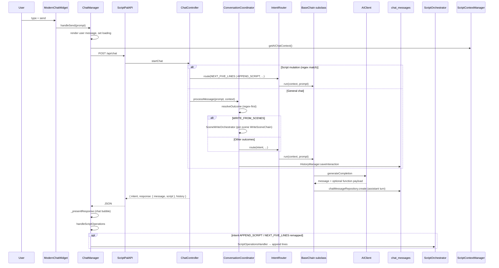

# AI Conversation Code — Developer Guide

> **Audience:** New developers working on ScriptPal chat, AI routing, or script-append behavior.  
> **Last updated:** May 2026  
> **Related:** `docs/ai-chat-implementation-plan.md` (approved refactor plan), `docs/AI_CHAT_FLOW_E2E.md` (deeper chain/validation detail), `docs/chat-routes.md`, `shared/promptRegistry.js`

---

## What This System Does

ScriptPal’s AI chat lets users talk to an assistant **in the context of a screenplay**. Depending on what they type, the backend either:

1. **Mutates the script** (next 5 lines, append page, full script) — fast path, regex-detected before general chat runs, or  
2. **Converses** (Q&A, reflection, script discussion) — `ConversationCoordinator` classifies intent, then runs a LangChain-style **chain** that calls the AI provider.

The frontend shows assistant text in the chat panel and, when the response includes script XML, appends lines into the editor via `ScriptOrchestrator`.

---

## End-to-End Flow (One Message)



---

## Two Backend Entry Paths

All user messages hit **`POST /api/chat`** → `chatController.startChat` (`server/controllers/chat/chat.controller.js`).

### Path A — Script mutation (deterministic routing)

If the request has a `scriptId` and the prompt (or flags) match heuristics, the controller **never** calls `ConversationCoordinator`. It builds chain context and calls `router.route` directly.

| Trigger | Detection | Handler | Chain (via registry) |
|--------|-----------|---------|----------------------|
| Next 5 lines | `isNextFiveLinesRequest(prompt)` | `SCRIPT_INTENT_HANDLERS.nextFiveLines` | `ScriptNextLinesChain` |
| Append page / scene | `forceAppend` or `isAppendPageRequest(prompt)` | `SCRIPT_INTENT_HANDLERS.appendPage` | `ScriptPageAppendChain` (intent `APPEND_SCRIPT`) |
| Full script | `forceFullScript` or `isFullScriptRequest(prompt)` | `SCRIPT_INTENT_HANDLERS.fullScript` | Routed as `APPEND_SCRIPT` |

Heuristics live in `server/controllers/chat/intent/heuristics.js`.  
Context for these paths is built with `buildPromptContext` (`server/controllers/script/context-builder.service.js`) and system prompts from `shared/promptRegistry.js` (`next-five-lines`, `append-page`).

Responses are validated with `buildValidatedChatResponse` (`server/controllers/chat/response/validation.js`) before returning.

### Path B — General conversation

If no script-mutation handler matches:

1. `new ConversationCoordinator(userId, scriptId)`  
2. `processMessage(prompt, context)` (`server/controllers/chat/orchestrator/ConversationCoordinator.js`)  
3. **Intent selection:** AI `IntentClassifier` first; fallback `determineIntent()` using heuristics (`isGeneralConversation`, `isReflectionRequest`, else `SCRIPT_CONVERSATION`)  
4. `buildContext()` → `router.route(intentResult, preparedContext, prompt)`  
5. `HistoryManager.saveInteraction()` persists user + assistant rows (unless `BaseChain` already logged usage)

---

## Intent → Chain Registry

`server/controllers/langchain/chains/registry.js` maps intent strings to chain classes. The router (`server/controllers/langchain/router/index.js`) instantiates the class and calls `run(context, prompt)`.

| Intent constant | Chain class | Typical use |
|-----------------|-------------|-------------|
| `GENERAL_CONVERSATION` | `DefaultChain` | Small talk, no script focus |
| `SCRIPT_CONVERSATION` | `ScriptAppendChain` | Discuss/extend script in chat |
| `SCRIPT_REFLECTION` | `ScriptReflectionChain` | Critique / analysis language |
| `NEXT_FIVE_LINES` | `ScriptNextLinesChain` | Fast path only (controller) |
| `SCENE_IDEA` / `CHARACTER_IDEA` / … | Idea chains | Creative prompts (when classified) |

Shared intent names: `shared/langchainConstants.js` and `server/controllers/langchain/constants.js`.

Every chain extends **`BaseChain`** (`server/controllers/langchain/chains/base/BaseChain.js`):

- Builds OpenAI-style `messages[]` (system + history + user)  
- Calls `ai.generateCompletion()` from `server/lib/ai.js` (wraps `AIClient`)  
- Optionally generates follow-up question buttons via `QuestionGenerator`  
- Logs assistant output + token usage to `chatMessageRepository`

---

## API Contract (v2 — use this shape)

**Request**

```http
POST /api/chat
Content-Type: application/json

{
  "prompt": "Write the next five lines",
  "context": {
    "scriptId": 42,
    "scriptTitle": "My Script",
    "scriptVersion": "1",
    "forceAppend": false,
    "forceFullScript": false,
    "chatRequestId": "optional-correlation-id"
  }
}
```

**Response (canonical)**

```json
{
  "success": true,
  "intent": "NEXT_FIVE_LINES",
  "scriptId": 42,
  "scriptTitle": "My Script",
  "timestamp": "2026-05-20T12:00:00.000Z",
  "mode": "NEXT_FIVE_LINES",
  "validation": { "valid": true, "errors": [] },
  "response": {
    "message": "Here are five lines continuing the scene.",
    "script": "<speaker>JOHN</speaker>\n<dialog>Hello.</dialog>",
    "metadata": { "lineCount": 5, "grammarValid": true },
    "type": "NEXT_FIVE_LINES"
  },
  "history": []
}
```

| Field | Consumer | Notes |
|-------|----------|-------|
| `response.message` | Chat UI | Display text only |
| `response.script` | Editor append | XML-tagged screenplay lines; may be `null` |
| `response.metadata` | Validation / debugging | Grammar, line count, contract validation |
| `intent` | `ChatManager.handleScriptOperations` | Drives editor side effects |
| `history` | Optional re-render | Recent DB rows serialized for the script |

Normalization is centralized in `server/controllers/common/ai-response.service.js` (`buildAiResponse`, `normalizeAiResponse`).  
Client validation for append: `validateAiResponse` in `shared/langchainConstants.js`.

---

## Frontend Architecture

### Bootstrap

`AuthenticatedAppBootstrap` creates `ChatIntegration` (`public/js/app/bootstrap/AuthenticatedAppBootstrap.js`), which wires:

| Component | File | Role |
|-----------|------|------|
| UI shell | `public/js/widgets/chat/ui/ModernChatWidget.js` | Input, message list, typing indicator |
| Orchestration | `public/js/widgets/chat/core/ChatManager.js` | Send flow, render, script ops |
| API | `public/js/services/api/ScriptPalAPI.js` → `ChatService.js` | `getChatResponse`, history CRUD |
| History cache | `public/js/widgets/chat/core/ChatHistoryManager.js` | Loads `GET /chat/messages` per script |
| Prompt shortcuts | `public/js/widgets/chat/integration/PromptHelperBridge.js` | UI buttons → system prompts |
| Script context | `public/js/widgets/editor/context/ScriptContextManager.js` | Builds `context` for POST body |

HTML mount point: `.chatbot-container` (see `public/js/constants.js` → `CHAT_PANEL`).

### Send pipeline (`ChatManager.handleSend`)

1. **`validateSendConditions`** — not empty, not double-send (`ChatValidationService.js`)  
2. **User message** — `processAndRenderMessage` (user bubble)  
3. **`getApiResponseWithTimeout`** — 30s race; merges `ScriptContextManager.getAIChatContext()`  
4. **`_presentResponse`** — uses `ResponseExtractor.extractApiResponseContent` for assistant text; may append `history` rows from server  
5. **`handleScriptOperations`** — if `intent === 'NEXT_FIVE_LINES'`, remap to `APPEND_SCRIPT` and pass `response.script` as content  
6. **`ScriptOperationsHandler`** — validates append contract, calls `ScriptOrchestrator.handleScriptAppend`

Extraction helpers: `public/js/widgets/chat/core/ResponseExtractor.js` (prefer these over ad-hoc field guessing).

### Editor side effects

| Intent (frontend) | Handler | Downstream |
|-------------------|---------|------------|
| `APPEND_SCRIPT` | `ScriptOperationsHandler._handleScriptAppend` | `ScriptOrchestrator` → editor commands (`ADD`) |
| `EDIT_SCRIPT` / `WRITE_SCRIPT` | `_handleScriptEdit` | Full or partial script replace |
| `ANALYZE_SCRIPT` | `_handleScriptAnalysis` | Renders analysis in chat + event |

---

## Other Chat-Related Endpoints

| Method | Path | Controller | Purpose |
|--------|------|------------|---------|
| `GET` | `/api/chat/messages?scriptId=` | `getChatMessages` | Load persisted history |
| `POST` | `/api/chat/messages` | `addChatMessage` | Manual persist (user/assistant) |
| `DELETE` | `/api/chat/messages/:scriptId` | `clearChatMessages` | Clear script thread |
| `POST` | `/api/system-prompts` | `system-prompt.controller.js` | Predefined prompts (welcome, ideas) without free-text routing |

Routes: `server/routes.js` (all use `validateSession`; message routes also `requireScriptOwnership`).

---

## Persistence

**Table:** `chat_messages` (Prisma migration under `server/prisma/migrations/`)

**Repository:** `server/repositories/chatMessageRepository.js`  
- `create`, `listByUser`, `clearByUserAndScript`  
- Stores `role`, `content`, `intent`, `metadata` (JSON), token/cost fields when logged from chains

**Serialization:** `server/serializers/chatMessageSerializer.js` — flattens DB rows for API `history` arrays.

**Server history write paths:**

- `HistoryManager` — conversation path (user prompt + assistant reply)  
- `BaseChain.execute` — logs assistant turn with `metadata.userPrompt` for replay in prompt history

**Client history:** `ChatHistoryManager` loads on script switch; dedupes rapid reloads (2s window).

---

## Prompts and Configuration

| Source | Location | Used for |
|--------|----------|----------|
| Prompt registry | `shared/promptRegistry.js` | System instructions per feature (`next-five-lines`, etc.) |
| System prompt map | `shared/systemPrompts.js` | `POST /system-prompts` types |
| Chain config | `server/controllers/chat/chain/config.js` | Temperature, `shouldGenerateQuestions`, model options |
| Screenplay contract | `shared/langchainConstants.js` | XML tags, grammar rules, `validateAiResponse` |

When adding a new AI behavior, you usually touch: registry entry → chain class → registry map → (optional) heuristic or classifier label.

---

## Key Files Checklist (start here)

### Frontend (read in this order)

1. `public/js/widgets/chat/integration/ChatIntegration.js` — wiring  
2. `public/js/widgets/chat/core/ChatManager.js` — send/receive/orchestration  
3. `public/js/widgets/chat/core/ResponseExtractor.js` — response parsing  
4. `public/js/widgets/chat/core/ScriptOperationsHandler.js` — editor intents  
5. `public/js/services/api/ChatService.js` — HTTP  
6. `public/js/widgets/editor/context/ScriptContextManager.js` — outbound context  

### Backend (read in this order)

1. `server/controllers/chat/chat.controller.js` — HTTP entry + fast paths  
2. `server/controllers/chat/orchestrator/ConversationCoordinator.js` — general chat  
3. `server/controllers/langchain/router/index.js` — intent → chain  
4. `server/controllers/langchain/chains/base/BaseChain.js` — AI call + DB log  
5. `server/controllers/langchain/chains/registry.js` — intent map  
6. `server/controllers/script/context-builder.service.js` — script + history bundle  
7. `server/controllers/common/ai-response.service.js` — response shape  
8. `server/services/AIClient.js` — provider retries, cost  

### Tests worth running

```powershell
# From repo root — adjust if your test runner differs
npm test -- public/js/__tests__/widgets/chat/
npm test -- server/__tests__/controllers/chat.test.js
npm test -- server/__tests__/chains/script-next-lines-chain.test.js
```

---

## Common Development Tasks

### Change how “next 5 lines” is detected

Edit patterns in `server/controllers/chat/intent/heuristics.js` (`NEXT_FIVE_LINES_PATTERN`). Controller fast path in `resolveScriptHandler` must still agree.

### Add a new conversational intent

1. Add constant in `server/controllers/langchain/constants.js` / `shared/langchainConstants.js`  
2. Create chain under `server/controllers/langchain/chains/` extending `BaseChain`  
3. Register in `chains/registry.js`  
4. Teach `IntentClassifier` or `ConversationCoordinator.determineIntent` to return the new intent  
5. If the UI must mutate the editor, handle the intent in `ChatManager.handleScriptOperations` / `ScriptOperationsHandler`

### Change chat bubble text only

Usually `response.message` from chain `formatResponse` or `buildAiResponse` — do not put screenplay XML in `message` (use `script`).

### Change what gets appended to the editor

1. Server: ensure chain output normalizes to `script` (XML tags per `SCREENPLAY_GRAMMAR_V1`)  
2. Client: `extractFormattedScriptFromResponse` → `ScriptOperationsHandler._handleScriptAppend`  
3. `ScriptOrchestrator.handleScriptAppend` — line splitting and `ADD` commands

### Debug a failed append

1. Network tab: `response.script` empty? → chain or validation failed server-side  
2. Console: `[ScriptOperationsHandler] Validation failed` → `validateAiResponse` contract mismatch  
3. Server logs: `[ChatController] script mutation validation failed` → `buildValidatedChatResponse`  
4. Chain logs: `[ScriptNextLinesChain]` grammar / line count retries  

---

## Design Rules (do not break casually)

1. **v2 response shape** — `message` + `script` only; avoid reviving legacy aliases (`content`, `formattedScript` at top level) without updating `ResponseExtractor` and tests.  
2. **Script mutations bypass general chat** — regex fast path prevents accidental fallback to `DefaultChain` mid-append.  
3. **`NEXT_FIVE_LINES` → `APPEND_SCRIPT` on the client** — server returns distinct intent; frontend remaps before `ScriptOperationsHandler`.  
4. **Ownership** — script-scoped routes verify `verifyScriptOwnership` / `requireScriptOwnership`.  
5. **Correlation** — `chatRequestId` from body or `x-correlation-id` header threads logs across controller → chain → AI.

---

## ASCII Overview (layers)

```
[Browser]
  ModernChatWidget → ChatManager → ScriptPalAPI.chat → POST /api/chat
                              ↓
                    ScriptOperationsHandler → ScriptOrchestrator → Editor

[Node server]
  routes.js → chat.controller.startChat
        ├─ resolveScriptHandler? → buildPromptContext → IntentRouter → Chain
        └─ ConversationCoordinator → classify → buildContext → IntentRouter → Chain
                                              ↓
                                        BaseChain → AIClient → OpenAI/Anthropic
                                              ↓
                                        chatMessageRepository → MySQL
```

---

## Glossary

| Term | Meaning |
|------|---------|
| **Chain** | Class that builds prompts and calls the AI for one intent |
| **Intent** | String label routing to a chain (`NEXT_FIVE_LINES`, etc.) |
| **Fast path** | Controller-level regex routing for script mutations |
| **Context bundle** | Script text, collections, chat history, system prompt passed into chains |
| **Canonical response** | API object with `response.message` and `response.script` |

---

*For exhaustive chain validation (grammar repair, function calling, retries), see `docs/AI_CHAT_FLOW_E2E.md`.*
